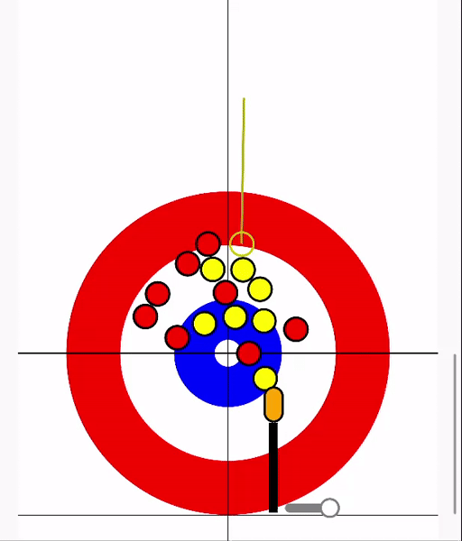

# Simple Curling Simulator

A simulation of the game of curling, for practising the right calls - execution (including
sweeping) is outside the players' control, so be sure to consider all possible outcomes!
Written in Rust with [Slint](https://slint.dev); the browser version below is the same code
compiled to WebAssembly.

 

You can play the [browser version](https://farmaazon.github.io/gielo/): set up the player names
and their accuracy (average error of weight and angle), then press Start. Click on the sheet
to place a marker and see the stone's most probable resting position (don't adjust the marker for
sweeping - it's assumed to be "included" in the delivering player's accuracy). Right-click to
quickly switch rotation. Weight is expressed as hog-to-hog time - check "automatic" to set
the weight to reach the marker.

## Building the desktop version

```
$ cargo run --release
```
Tested mostly on Linux, but should work on all platforms supported by Slint.

## Simulation details
  
To keep the simulation fast for analysis (e.g. quickly generating "heatmaps" of possible
outcomes), it is advanced not step-by-step but event-to-event: from a starting situation we
compute when the next event happens - a collision, a stone leaving play, or a stone coming to
rest - and after each event recompute the velocity and acceleration vectors.
  
The "curling" of a stone's trajectory is modelled as a constant* force applied perpendicular to
its motion. Because this acceleration vector rotates over time, computing it exactly is too
complex; instead it is updated once per time quantum. The quantum length is adaptive — it ends
when the approximation drifts too far from the true vector, so it's longer at high velocities.

*Not quite how real curling stones behave — they tend to curl more as their rotation slows down.
Something to improve in the future.
  
